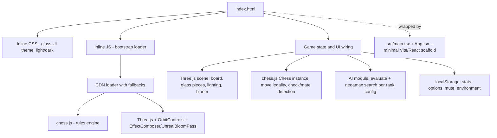
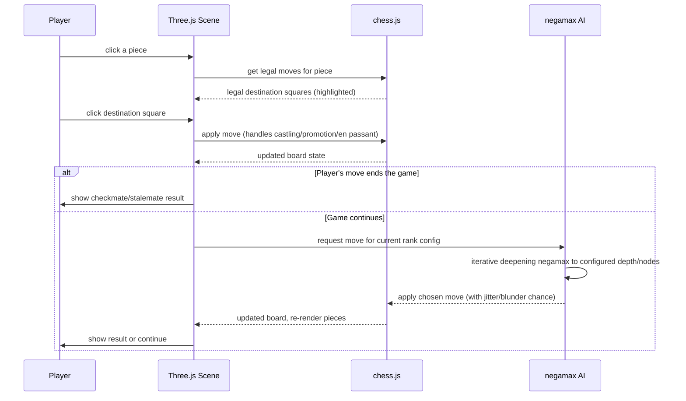

<p align="center">
  
</p>

# 3d-chess — Glass Gambit

A single-page, browser-based 3D chess game with glassmorphic piece and board rendering, and a built-in AI opponent with 10 selectable difficulty ranks.

## Executive Summary
Glass Gambit is a self-contained chess game rendered in 3D using Three.js, with legal-move rules and game-state handling delegated to the chess.js library. It is aimed at casual players who want a visually polished, offline-playable chess game against a computer opponent, without needing an account or backend. The AI uses a negamax search with configurable depth, node budget, move jitter, and blunder rate per rank, so difficulty scales from "Novice" (shallow search, frequent blunders) to "Immortal" (deep search, zero blunders). Local stats (win/loss record per rank) and UI preferences persist in the browser via `localStorage`. Current state: the game is playable end-to-end in a browser tab; almost all game logic, styling, and the 3D scene live in one large `index.html` file rather than the React/Vite scaffold that wraps it.

## Features
- Full 3D chessboard and pieces rendered with Three.js, using physical "glass" materials, bloom post-processing, and orbit camera controls (drag to orbit, scroll to zoom)
- Legal chess rules (moves, check, checkmate, stalemate, castling, promotion) handled via the chess.js library, loaded with multi-CDN fallbacks for resilience
- AI opponent with 10 named difficulty ranks (Novice through Immortal), each with its own search depth (1-4 ply), node budget, move-jitter randomness, and blunder probability
- Negamax search with alpha-beta pruning and iterative deepening (`negamax`, `evaluate` functions) for move selection
- Pawn promotion UI (choose the promoted piece)
- Light and dark UI themes (`data-theme` attribute), with additional selectable visual "environments" for the board/scene
- Sound effects with a persisted mute/unmute toggle
- Local win/loss statistics tracked per opponent rank, persisted in `localStorage`
- Persisted user options/settings across sessions
- Responsive on-screen HUD showing current opponent rank, hints, and game result (e.g. "Checkmate")

## Architecture


## How It Works / Process Flow


## Tech Stack
- Vanilla JavaScript (game logic, AI, and UI wiring live in a single inline `<script>` in `index.html`)
- Three.js (r0.147) — 3D rendering, `OrbitControls`, `EffectComposer`/`UnrealBloomPass` for bloom, `MeshPhysicalMaterial` for glass
- chess.js — chess rules, move legality, check/checkmate/stalemate detection
- Loaded via CDN with fallback URLs (unpkg, cdnjs) and runtime capability checks rather than npm imports
- `localStorage` for stats, options, mute state, and selected environment
- Google Fonts: Cinzel (display) + Jost (UI body)
- A minimal React 18 + TypeScript + Vite 6 + Tailwind 4 scaffold (`src/App.tsx`, `src/main.tsx`) wraps the page but is not where the game logic lives

## Setup / Running Locally
```bash
npm install
npm run dev        # Vite dev server
npm run build       # production build
npm run typecheck   # TypeScript check, no emit
```
Because the game itself is implemented directly in `index.html` with CDN-loaded libraries, it can also be opened directly in a browser without running the Vite toolchain, as long as it has internet access to fetch chess.js and Three.js from CDN.

## Project Structure
- `index.html` — the actual game: inline CSS (glass UI theme), CDN loader with fallbacks, Three.js scene setup, chess.js integration, AI (`evaluate`/`negamax`), stats/options persistence, and all UI wiring (~2,550 lines)
- `src/App.tsx`, `src/main.tsx` — minimal React/Vite entry scaffold that the sandbox tooling expects; not where gameplay logic lives
- `src/index.css` — base stylesheet for the Vite scaffold
- `vite.config.js`, `tsconfig.json` — build tooling configuration
